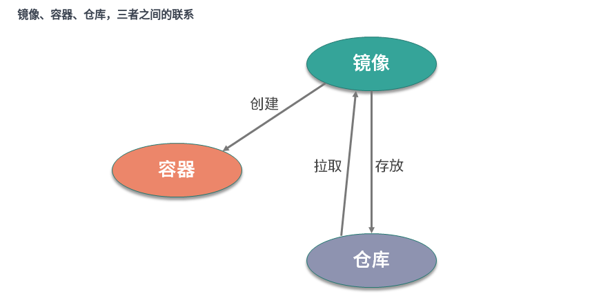
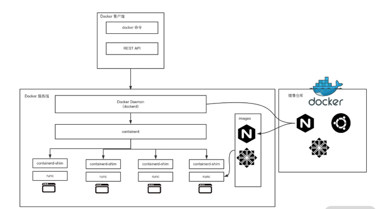
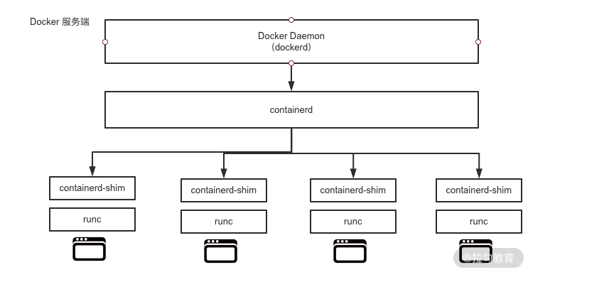

# Docker核心概念：镜像、容器、仓库，彻底掌握Docker架构核心设计理念

Docker的操作围绕镜像、容器、仓库三大核心概念。在学架构设计之前。我们需要县了解Docker的三个核心概念

## Dpcler的核心概念

### 镜像

镜像是什么呢？通俗的讲，它只是一个只读的文件和文件夹的组合。它包含了容器运行时所需要的基础文件和配置信息，是容器启动的基础。所以你想启动一个容器，那首先必须要有一个镜像。Docker容器启动的先决条件。

如果你想要使用一个镜像，你可以用两种方式：

1. 自己创建镜像。通常情况下，一个镜像是基于一个基础镜像构建的，你可以在基础镜像上添加一些用户自定义的内容。例如你可以基于`ubuntu`镜像制作你自己的业务镜像，首先安装`nginx`服务，然后部署你的应用程序，最后做一些自定义配置，这样一个业务镜像就做好了。
2. 从功能镜像仓库拉取别人制作好的镜像。一些常用软件或者系统都会有官方已经制作好的镜像，例如：`nginx`、`ubuntu`、`centos`、`mysql`等，你可以到[Docker Hub](https://hub.docker.com/)搜索并下载它们。

### 容器

容器是什么呢？容器是Docker的另一个核心概念。通俗的讲，容器是镜像的运行实体。镜像是静态的只读文件，而容器带有运行时所需要的可写文件层，并且容器中的进程属于运行状态，即容器运行着真正的应用进程。容器有创建、运行、停止、暂停和删除五种状态。

虽然容器的本质是主机上运行的一个进程，但是容器有自己独立的命令空间隔离和资源限制。也就是说，在容器内部，无法看到主机上的进程、环境变量、网络等信息，这是容器与直接运行在主机上进程的本质区别。

### 仓库

Docker的镜像仓库类似于代码仓库，用来存储和分发Docker镜像，镜像仓库分为公共镜像仓库和私有镜像仓库。

目前[Docker Hub](https://hub.docker.com/)是Docker官方的公开镜像从那个库，它不仅有很多应用或者操作系统的官方镜像，还有很多组织或者个人开发者的镜像供我们免费存放、下载、研究和使用。除了公开镜像仓库，你也可以构建自己的私有镜像仓库，后面会讲到。



从上图我们可以看到，镜像是容器的基石，容器是由镜像创建的。一个镜像可以创建多个容器，容器是镜像运行的实体。仓库就非常好理解了，就是用来存放和分发镜像的。

了解了Docker三大核心概念，接下来认识下Docker的核心架构和一些重要的组件。

## Docker架构

在了解Docker架构前，我先说下相关的背景知识——容器的发展史。

容器技术随着Docker的出现变得炙手可热，所有公司都在积极的拥抱容器技术。此时市场上除了有Docker容器，还有很多其他的容器技术与，比如CoreOS的rkt、lxc等。容器技术百花齐放是好事，但也出现了很多问题。比如容器技术的标准到底是什么？容器标准应该由谁来制定？

也许你可能会说，Docker已经成为了事实标准，把Docker作为容器技术的标准不就好了？事实上并没有想象的那么简单。因为那时候不仅有容器标准之争，编排技术之争也十分激烈。当时的编排技术有三大主力，分别是Docker Swarm、Kubernetes和Mesos。Swarm毋庸置疑，肯定愿意把Docker作为唯一的容器运行时，但是Kubernetes和Mesos就不同意了，因为它们不希望调度的形式过渡单一。

在这样的背景下，最终爆发了容器大战，`OCI`也正是在这样的背景下应运而生。

`OCI`全称为开发容器标准（Open Container Initiative），它是一个轻量级，开发的治理结构。`OCI`主治在Linux基金会的大力支持下，与2015年6月份正式注册成立。基金会旨在为用户围绕工业化容器的格式和镜像运行时，制定一个开发的容器标准。目前主要有两个标准文档：容器运行时标准（runtime spec）和容器镜像标准（image spec）。

正是由于容器的战争，才导致Docker不得不在战争中改变一些技术架构。最终形成了下图所示的技术架构。



我们可以看到，Docker整体架构采用C/S（客户端/服务器）模式，主要由客户端和服务端两大部分组成。客户端负责发送操作指令，服务端负责接受和处理指令。客户端和服务端通信有多种法那个是，既可以在同一台机器上通过`UNIX`套接字通信，也可以通过网络连接远程通信。

下面逐一介绍客户端和服务器。

### Docker客户端

Docker客户端其实是一种泛称。其中docker命令是DOcker用户与Docker服务端交互的主要方式。除了使用docker命令的方式，还可以使用直接请求REST API的方式与Docker服务端交互，甚至还可以使用各种语言的SDK与Docker服务端交互。目前社区维护者Go、Java、Python、PHP等数十种语言的SKD，足以满足你的日常所需。

### Docker服务端

DOcker服务端是Docker所有后台服务的统称。其中dockerd是一个非常重要的后台管理进程，它服务响应和处理来自Docker客户端的请求，然后将客户端的请求转化为Docker的具体操作。例如镜像、容器、网络和挂载卷等具体对象的操作和管理。

Docker从诞生到现在，服务器经历多次u架构重构。日出服务端的组建是全部集成在docker二进制里。但是从1.11版本开始，dockerd已经成了独立的二进制，此时的容器技术也不是直接由dockerd来启动了，而是集成了containerd、runC等多个组件。

虽然Docker的架构在不停的重构，但是各个模块的基本功能和定位并没有变化。它和一般的C/S架构系统一样，DOcker服务端模块负责和Docker客户端交互，并管理Docker的容器、镜像、网络等资源。

### Docker重要组件

下面我们看看Docker 28.0.1版本下有那些工具和组件。在Docker安装路径下和造型ls命令可以看到以下与docker有关的二进制文件。

```bash
-rwxr-xr-x 1 root root 27941976 Dec 12  2019 containerd
-rwxr-xr-x 1 root root  4964704 Dec 12  2019 containerd-shim
-rwxr-xr-x 1 root root 15678392 Dec 12  2019 ctr
-rwxr-xr-x 1 root root 50683148 Dec 12  2019 docker
-rwxr-xr-x 1 root root   764144 Dec 12  2019 docker-init
-rwxr-xr-x 1 root root  2837280 Dec 12  2019 docker-proxy
-rwxr-xr-x 1 root root 54320560 Dec 12  2019 dockerd
-rwxr-xr-x 1 root root  7522464 Dec 12  2019 runc
```

可以看到，Docker目前已经有了非常多的组件和工具。后面会讲，我们先来了解两个至关重要的组件`runC`和`containerd`。

- `runC`是Docker官方按照OCI容器运行时标准的一个实现。通俗的讲，runC是一个用来运行容器的轻量级工具，是真正用来运行容器的。
- `containerd`是Docker服务端的一个核心组件，它是从`docker`中剥离出来的，它的诞生完全遵守OCI标准，是容器标准化后的产物。`containerd`通过containerd-shim启动并管理runC，可以说`containerd`真正管理了容器的生命周期。



通过上图可以看到，`dockerd`通过gRPC与`containerd`通信，由于`docker`与真正的容器运行时，`runC`中间有了`containerd`这一OCI标准层，使得`dockerd`可以确保接口向下兼容。

> gRPC是一种远程服务调用。想要了解更多信息可以参考https://grpc.io/ containerd-shim的意思是点片，类似于柠螺丝是夹在螺丝和螺母之前的垫片。containerd-shim的主要作用是将containerd和真正容器进程解耦，使用containerd-shim作为容器进程的父进程，从而实现重启containerd不影响已经启动的容器进程。

了解了dockerd，containerd和runC之间的关系，下面可以通过启动一个Docker容器，来验证它们进程之间的关系。

### Docker各组件之间的关系

首先通过以下命令来启动一个busybox容器：

```bash
$ docker run -d busybox sleep 3600
```

容器启动后，通过以下命令查看以下dockerd的PID：

```bash
$ sudo ps aux |grep dockerd
root      4147  0.3  0.2 1447892 83236 ?       Ssl  Jul09 245:59 /usr/bin/dockerd
```

通过上面的输出结果可以得知dockerd的PID为4147。为了验证Docker中各组件之间的调用关系，下面和四用pstree命令查看以下进程父子关系：

```bash
$ sudo pstree -l -a -A 4147
dockerd
  |-containerd --config /var/run/docker/containerd/containerd.toml --log-level info
  |   |-containerd-shim -namespace moby -workdir /var/lib/docker/containerd/daemon/io.containerd.runtime.v1.linux/moby/d14d20507073e5743e607efd616571c834f1a914f903db6279b8de4b5ba3a45a -address /var/run/docker/containerd/containerd.sock -containerd-binary /usr/bin/containerd -runtime-root /var/run/docker/runtime-runc
  |   |   |-sleep 3600
```

事实上，dockerd启动的时候，containerd就随之启动了，dockerd与containerd一直存在。当执行docker run命令（通过busybox镜像创建并启动容器）时，containerd会创建containerd-shim充当垫片进程，然后启动容器的真正进程sleep 3600.这个过程和架构图是完全一致的。