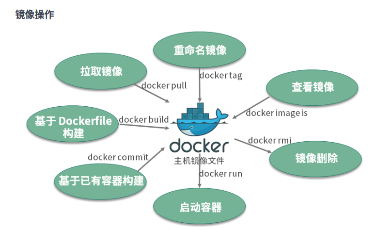
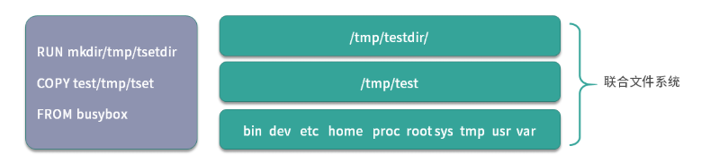

## Docker镜像使用：Docker环境下如何配置你的镜像？

今天我们围绕着Docker核心概念展开，首先重点讲解一下镜像的基本操作，然后介绍一下镜像的实现原理。首先说明，此章中的镜像均指Docker镜像。

你是否还记得镜像是什么？我们先回顾以下。

镜像是一个只读的Docker容器模板，包含启动容器所需要的所有文件系统结构和内容。简单来讲，镜像是一个特殊的文件系统，它提供了容器运行时所需要的程序、软件库、资源、配置等静态数据。即镜像不包含任何动态数据，镜像内容在构建后不会被改变。

然后我们来看下如何操作镜像。



从图中可知，镜像的操作可分为：

- 拉取镜像，使用`docker pull`命令拉取远程仓库的镜像到本地；
- 重命名镜像，使用`docker tag`命令重命名镜像；
- 查看镜像，使用`docker image ls`或者`docker images`命令查看本地已经存在的镜像；
- 删除镜像，使用`docker rmi`命令删除无用镜像；
- 构建镜像，构建镜像有两种方式。第一种方式是使用`docker build`命令基于Dockerfile构建镜像，也是我比较推荐的构建方式；第二种方式是使用`docker commit`命令基于已经运行的容器提交为镜像

下面我们逐一详细介绍。

## 拉取镜像

Docker镜像的拉取使用`docker pull`命令，命令格式一般为`docker pull [Registry]/[Respository]/[Imaage]:[Tag]`。

- Registry为注册服务器，Docker默认会从docker.io拉取镜像，如果你有自己的镜像仓库，可以把Registry替换为自己的注册服务器。
- Respository为镜像仓库，通常把一组相关联的镜像归为一个镜像仓库，`library`为Docker默认的镜像仓库。
- Image为镜像名称。
- Tag为镜像的标签，如果你不指定拉取镜像的标签，默认为`lastest`。

例如我们需要获取一个busybox镜像，可以执行以下命令：

> busybox是一个集成了数百个Linux命令的精简工作箱，只有几兆左右，被誉为Linux系统的瑞士军刀。我经会使用busybox做调试来查找生产环境中遇到的问题。

```bash
$ docker pull busybox
Using default tag: latest
latest: Pulling from library/busybox
61c5ed1cbdf8: Pull complete
Digest: sha256:4f47c01fa91355af2865ac10fef5bf6ec9c7f42ad2321377c21e844427972977
Status: Downloaded newer image for busybox:latest
docker.io/library/busybox:latest
```

实际上执行`docker pull busybox`命令都是先从本地搜索，如果本地搜索不到`busybox`镜像则从Docker Hub下载镜像。

## 查看镜像

Docker镜像查看使用`docker images`或者`docker image ls`命令。

下面我们使用`docker images`命令列出本地所有的镜像。

```bash
$ docker images
REPOSITORY          TAG                 IMAGE ID            CREATED             SIZE
nginx               latest              4bb46517cac3        9 days ago          133MB
nginx               1.15                53f3fd8007f7        15 months ago       109MB
busybox             latest              018c9d7b792b        3 weeks ago         1.22MB
```

如果我们想要查询指定的镜像，可以使用`docker image ls`命令来查询。

```bash
$ docker image ls busybox
REPOSITORY          TAG                 IMAGE ID            CREATED             SIZE
busybox             latest              018c9d7b792b        3 weeks ago         1.22MB
```

当然你也可以使用`docker images`命令列出所有镜像，然后使用`grep`命令进行过滤。使用方法如下：

```bash
$ docker images |grep busybox
busybox             latest              018c9d7b792b        3 weeks ago         1.22MB
```

## 重命名镜像

如果你想要自定义镜像名称或者推送镜像到其他镜像仓库，你可以使用`docker tag`命令将镜像重命名。`docker tag`的命令格式为`docker tag [SOURCE_IMAGE][:TAG] [TARGET_IMAGE][:TAG]`/

下面我们通过实例演示一下：

```bash
$ docker tag busybox:latest mybusybox:latest
```

执行完`docker tag`命令后，可以使用查询镜像命令查看一下镜像列表：

```bash
$ docker images
REPOSITORY          TAG                 IMAGE ID            CREATED             SIZE
busybox             latest              018c9d7b792b        3 weeks ago         1.22MB
mybusybox           latest              018c9d7b792b        3 weeks ago         1.22MB
```

可以看到，镜像列表中多了一个`mybusybox`的镜像。但细心的同学可能已经发现了，`bosybox`和`mybusybox`这两个镜像的IMAGE ID是完全一样的？为什么呢？实际上它们指向了同一个镜像文件，只是别名不同而已。

## 删除镜像

你可以使用`docker rmi`或者`docker image rm`命令删除镜像：

```bash
$ docker rmi mybusybox
Untagged: mybusybox:latest
```

此时，再次使用`docker images`命令查看一下我们机器上的镜像列表。

```bash
$ docker images
REPOSITORY          TAG                 IMAGE ID            CREATED             SIZE
busybox             latest              018c9d7b792b        3 weeks ago         1.22MB
```

通过上面的输出，我们可以看到，`mybusybox`镜像已经被删除。

## 构建镜像

构建镜像主要有两种方式：

1. 使用`docker commit`命令从运行中的容器提交为镜像；
2. 使用`docker build`命令从Dockerfile构建镜像；

首先接受哦阿下如何从运行中容器提交为镜像。我们依旧使用busybox镜像举例，使用一下命令创建一个名为busybox的容器并进入busbox容器

```bash
$ docker run --rm --name=busybox -it busybox sh
/ #
```

执行完上面的命令后，当前窗口会启动一个busybox容器并且进入容器中。在容器中，执行以下命令创建一个文件并写入内容：

```bash
/ # touch hello.txt && echo "I love Docker. " > hello.txt
/ #
```

此时在容器的根目录下，已经创建一个hello.txt文件。下面，我们新打开另一个命令行窗口，运行一下命令提交镜像：

```bash
$ docker commit busybox busybox:hello
sha256:cbc6406aaef080d1dd3087d4ea1e6c6c9915ee0ee0f5dd9e0a90b03e2215e81c
```

然后使用上面讲到的`docker image ls`命令查看镜像：

```bash
$ docker image ls busybox
REPOSITORY          TAG                 IMAGE ID            CREATED             SIZE
busybox             hello               cbc6406aaef0        2 minutes ago       1.22MB
busybox             latest              018c9d7b792b        4 weeks ago         1.22MB
```

此时我们可以看到主机上新生成了busybox:hello这个镜像。

第二种法那个是是最重要也是最常用的镜像构建方式：Dockerfile。Dockerfile是一个包含了用户所有构建命令的文本。通过docker build命令可以从Dockerfile生成镜像。

使用Dockerfile构建镜像具有一下特征：

- Dockerfile的每一行命令都会生成一个独立的镜像层，并且拥有唯一的ID；
- Dockerfile的命令是完全透明的，通过查看Dockerfile的内容，就可以指导镜像是如何一步步构建的；
- Dockerfile是纯文本的，方便跟随代码一起存放在代理仓库并做版本管理。

看到使用Dockerfile的方式构建镜像有这么多好的特性，你是不是已经迫不及待的想知道如何使用了。别集我们先学习下Dockerfile常用的指令。

| Dockerfile指令 | 指令简介                                                     |
| :------------- | :----------------------------------------------------------- |
| FROM           | Dockerfile除了注释第一行必须是FROM，FROM后面跟着镜像名称，代表着我们要基于那个基础镜像构建我们的容器。 |
| RUN            | RUN后面跟一个具体的命令，类似与Linux命令行执行命令。         |
| ADD            | 拷贝本机文件或者远程文件到镜像内。                           |
| COPY           | 拷贝本机文件到镜像内。                                       |
| USER           | 指定容器启动的用户。                                         |
| ENTRYPOINT     | 容器的启动命令。                                             |
| CMD            | CMD为ENTRYPOINT指令提供默认参数，也可以单独使用CMD指定容器参数。 |
| ENV            | 指定容器运行时的环境变量，格式为key=value。                  |
| ARG            | 定义外部便利那个，构建镜像时可以使用的build-arg=的格式传递参数用于构建。 |
| EXPOSE         | 指定容器监听的端口，格式为[port]/tcp或者[port]/udp           |
| WORKDIR        | 为Dockerfile中跟在其后的所有RUN、CMD、ENTRYPOINT、COPY、ADD命令设置工作目录。 |

看了怎么指令，感觉有点懵？别担心，我们通过一个实例来熟悉他们。这是一个Dockerfile：

```dockerfile
FROM centos:7
COPY nginx.repo /etc/yum.repos.d/nginx.repo
RUN yum install -y nginx
EXPOSE 80
ENV HOST=mynginx
CMD ["nginx","-g","daemon off;"]
```

好，我们诸行分析一下上述的Dockerfile。

- 第一行表示我要基于centos：7这个镜像来构建自定义镜像。这里需要注意的是，每个Dockerfile的第一行除了注释都必须一FROM开头。
- 第二行表示拷贝本地文件nginx.repo我呢间到容器内的/etc/yum.repos.d目录下，这里拷贝nginx.repos文件是为了添加nginx的安装源。
- 第二行表示在容器内运行`yum install -y nginx`命令，安装nginx服务到容器内，执行完第三行命令，容器内的nginx已经安装完成
- 第四行声明容器内业务（nginx）使用80对外提供服务。
- 第五行定义的容器启动时环境变量HOST=mynginx，容器启动后可以获取到环境变量HOST的值为mynginx。
- 第六行定义容器的启动命令，命令格式为json数组，这里设置了容器的启动命令为ienginx，并且添加了nginx的启动参数”-g“和”daemon off“，使得nginx以前台的方式启动。

## 镜像的实现原理

其实Docker镜像是由一系列镜像层（layer）组成的，每一层代表了镜像构建过程中的一次提交。下面一个镜像构建的Dockerfile来说明镜像是如何分层的。

```dockerfile
FROM busybox
COPY test /tmp/test
RUN mkdir /tmp/testdir
```

上面的Dockerfile由三步组成：

第一行基于busybox创建一个镜像层；

第二层拷贝本级test文件到镜像内；

第三层在/test文件夹下创建一个目录testdir。

为了验证镜像的存储结构，我们使用`docker build`命令在上面Dockerfile所在目录构建一个镜像：

```bash
$ docker build -t mybusybox .
```

这里我的Docker使用的是overlay2文件驱动，进入到`/var/lib/docker/overlay2`目录下使用`tree .`命令查看产生的镜像文件：

```bash
$ tree .
# 以下为 tree . 命令输出内容
|-- 3e89b959f921227acab94f5ab4524252ae0a829ff8a3687178e3aca56d605679
|   |-- diff  # 这一层为基础层，对应上述 Dockerfile 第一行，包含 busybox 镜像所有文件内容，例如 /etc,/bin,/var 等目录
... 此次省略部分原始镜像文件内容
|   `-- link 
|-- 6591d4e47eb2488e6297a0a07a2439f550cdb22845b6d2ddb1be2466ae7a9391
|   |-- diff   # 这一层对应上述 Dockerfile 第二行，拷贝 test 文件到 /tmp 文件夹下，因此 diff 文件夹下有了 /tmp/test 文件
|   |   `-- tmp
|   |       `-- test
|   |-- link
|   |-- lower
|   `-- work
|-- backingFsBlockDev
|-- bec6a018080f7b808565728dee8447b9e86b3093b16ad5e6a1ac3976528a8bb1
|   |-- diff  # 这一层对应上述 Dockerfile 第三行，在 /tmp 文件夹下创建 testdir 文件夹，因此 diff 文件夹下有了 /tmp/testdir 文件夹
|   |   `-- tmp
|   |       `-- testdir
|   |-- link
|   |-- lower
|   `-- work
...
```

通过上面的目录结构可以看到，Dockerfile的每一行命令，都生成了一个镜像层，每一层的diff夹下只存放了增量数据：



分层的结构是的Docker镜像非常轻量，每一层根据镜像的内容都有一个唯一的ID值，当不同的镜像之间有相同的镜像层时，便可以实现不同的镜像之间共享镜像层的效果。

总结一下，Docker镜像是静态在分层管理的文件组合，镜像地层的实现依赖于联合文件系统（UnionFS）。充分掌握镜像的原理，可以帮助我们在生产实践中构建出最优的镜像，同时也可以帮助我们更好的理解容器和镜像的关系。

## 总结

到此，相信你已经对Docker镜像这一核心的概念有了较深的了解，并熟悉了Docker镜像的常用操作（拉取、查看、重命名、删除和构建自定义镜像）及其底层实现原理。

>镜像操作命令：
>
>1. 拉取镜像，使用docker pull命令拉取亚uncheng仓库的镜像到本地；
>2. 重命名镜像， 使用docker tag命令重命名镜像；
>3. 查看镜像，使用docker images ls或者docker images命令查看本地已经存在的镜像；
>4. 删除镜像，使用docker rmi命令删除无用的镜像；
>5. 构建镜像，构建镜像有两种法那个是。第一种方式是使用docker build命令基于Dockerfile构建镜像，也是我们推荐的镜像构建方式；第二种方式是使用docker commit命令基于已经运行的容器提交为镜像。
>
>镜像的实现原理：景象是由一系列的镜像层（layer）组成，每一层代表了镜像构建过程中的一次提交，当我们需要修改镜像内的某个我呢间时，只需要在当前镜像层的基础上新建的一个镜像层，并且之存放那个修改过的文件内容。分层结构使得镜像间共享镜像层变得非常简单。