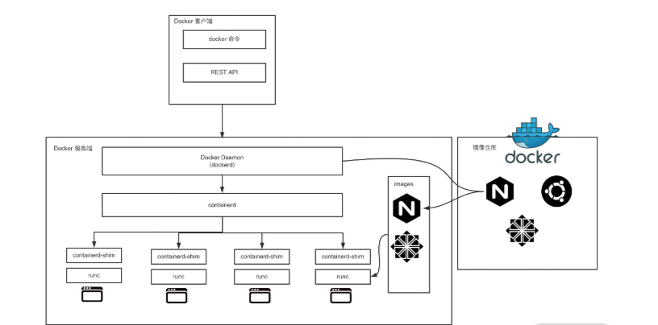

# 组件组成：剖析Docker组件作用及其底层工作原理

## Docker的组件构成

Docker整体架构采用C/S（客户端/服务器）模式，主要由客户端和服务端两大部分组成。客户端负责发送操作指令，服务端负责接收和处理指令。客户端和服务器通信有多种方式，既可以在统一台机器上通过UNIX套接字通信，也可以通过网络连接远程通信。



从整体架构可知，Docker组件大体分为Docker相关组件，containerd相关组件和容器运行时相关组件。

下面我们深入剖析下各个组件。

## Docker组件剖析

Docker到底有哪些组件呢？我们可以在Docker的安装路径下执行ls命令，这样可以看到以下与Docker有关的组件。

``` bash
-rwxr-xr-x 1 root root 27941976 Dec 12  2019 containerd

-rwxr-xr-x 1 root root  4964704 Dec 12  2019 containerd-shim

-rwxr-xr-x 1 root root 15678392 Dec 12  2019 ctr

-rwxr-xr-x 1 root root 50683148 Dec 12  2019 docker

-rwxr-xr-x 1 root root   764144 Dec 12  2019 docker-init

-rwxr-xr-x 1 root root  2837280 Dec 12  2019 docker-proxy

-rwxr-xr-x 1 root root 54320560 Dec 12  2019 dockerd

-rwxr-xr-x 1 root root  7522464 Dec 12  2019 runc
```

这些组件根据工作职责可以分为以下三大类。

1. Docker相关的组件：docker、dockerd、docker-init、docker-proxy
2. containerd相关的组件：containerd、container-shim、ctr
3. 容器运行时相关组件：runc

## Docker相关的组件

### docker

docker是Docker客户端的一个完整实现，它是一个二进制文件，对用户的可见的操作形式为docker命令，通过docker命令可以完成所有的Docker客户端与服务端的通信（还可以通过REST API、SDK等多种形式与Docker服务端通信）。

Docker客户端与服务端的交互过程是：docker组件向服务端发送请求后，服务端根据请求执行具体的动作并将结果返回给docker，docker解析服务端的返回结果，并将结果通过命令行标准输出展示给用户。这样一次完整的客户端服务端请求就完成了。

### dockerd

dockerd是Docker服务端的后台常驻进程，用来接受客户端发送的请求，执行具体的处理任务，处理完成后将结果返回给客户端。

Docker客户端可以通过多种方式向dockerd发送请求，我们常用的Docker客户端与dockerd的交互方式有三种。

- 通过UNIX套接字与服务端通信：配置格式为`unix://socker_path`，默认dockerd生成的socket文件路径为`/var/run/docker.sock`，该文件只有root用户或者docker用户组的用户才可以访问，这就是为什么Docker刚安装后只有root用户才能使用docker命令的原因。
- 通过TCP与服务端通信：配置格式为`tcp://host:port`，通过这种方式可以实现客户端远程连接服务端，但是在方便的同时也带有安全隐患，因此在生产环境中如果你要使用TCP的方式与Docker服务端通信，推荐使用TLS认证，可以通过设置Docker的TLS相关参数，来保证数据的安全。
- 通过文件描述符的方式与服务端通信：配置格式为：`fd://`这种格式一般用于systemd关系的系统中。

Docker客户端和服务端的通信形式必须保持一致，否则将无法通信，只有当dockerd监听了UNIX套接子客户端才可以使用UNIX套接字的方式与服务端通信，UNIX套接字也是Docker默认的通信方式，如果你想要通过远程的方式访问docker，可以在docker启动的时候添加-H参数指定监听的HOST和PORT。

### docker-init

如果你熟悉Linux系统，你应该知道Linux系统中，1号进程是init进程，是所有进程的父进程。主机上的进程出现问题的时候，init可以帮助我们回收这些问题进程。同样的，在容器的内部，当我们自己的业务进程没有回收子进程的能力时，在执行docker run启动容器可以添加--init参数，此时Docker会使用docker-init作为1号进程，帮助你管理容器内子进程，例如回收僵尸进程等。

下面我们通过启动一个busybox容器来演示下：

```bash
$ docker run -it busybox sh

/ # ps aux

PID   USER     TIME  COMMAND

    1 root      0:00 sh

    6 root      0:00 ps aux

/ #
```

可以看到容器启动时如果没有添加--init参数；1号进程就是sh进程。

我们使用Ctrl+D退出当前容器，重新启动一个新的容器并添加--init参数，然后看下进程：

```bash
$ docker run -it --init busybox sh

/ # ps aux

PID   USER     TIME  COMMAND

    1 root      0:00 /sbin/docker-init -- sh

    6 root      0:00 sh

    7 root      0:00 ps aux
```

可以看到此时容器内的1号进程已经变为了`/sbin/docker-init`，而不再是sh了。

### docker-proxy

docker-proxy主要是用来做点端口映射的。当我们使用docker run启动容器时，如果使用了-p参数，docker-proxy组件就会把容器内相应的端口映射到主机上来，底层是依赖于iptables实现的。

使用以下命令启动一个nginx容器并把容器的80端口映射到主机的8080端口。

```bash
$ docker run --name=nginx -d -p 8080:80 nginx
```

然后通过以下命令查看以下启动的容器IP：

```bash
$ docker inspect --format '{{ .NetworkSettings.IPAddress }}' nginx

172.17.0.2
```

可以看到，我们启动的nginx容器IP为172.17.0.2。

此时，我们使用ps命令查看以下主机上是否有docker-proxy进程：

```bash
$ sudo ps aux |grep docker-proxy

root      9100  0.0  0.0 290772  9160 ?        Sl   07:48   0:00 /usr/bin/docker-proxy -proto tcp -host-ip 0.0.0.0 -host-port 8080 -container-ip 172.17.0.2 -container-port 80

root      9192  0.0  0.0 112784   992 pts/0    S+   07:51   0:00 grep --color=auto docker-proxy
```

可以看到当我们启动一个容器的时候需要端口映射的时候，Docker为我们创建了一个docker-proxy进程，并且通过参数把我们的容器IP传递给docker-proxy进程，然后docker-proxy通过iptables实现了nat转发。

我们通过以下命令查看以下主机上的iptables nat表的规则：

```bash
$  sudo iptables -L -nv -t nat

Chain PREROUTING (policy ACCEPT 35 packets, 2214 bytes)

 pkts bytes target     prot opt in     out     source               destination

  398 21882 DOCKER     all  --  *      *       0.0.0.0/0            0.0.0.0/0            ADDRTYPE match dst-type LOCAL

Chain INPUT (policy ACCEPT 35 packets, 2214 bytes)

 pkts bytes target     prot opt in     out     source               destination

Chain OUTPUT (policy ACCEPT 1 packets, 76 bytes)

 pkts bytes target     prot opt in     out     source               destination

    0     0 DOCKER     all  --  *      *       0.0.0.0/0           !127.0.0.0/8          ADDRTYPE match dst-type LOCAL

Chain POSTROUTING (policy ACCEPT 1 packets, 76 bytes)

 pkts bytes target     prot opt in     out     source               destination

    0     0 MASQUERADE  all  --  *      !docker0  172.17.0.0/16        0.0.0.0/0

    0     0 MASQUERADE  tcp  --  *      *       172.17.0.2           172.17.0.2           tcp dpt:80

Chain DOCKER (2 references)

 pkts bytes target     prot opt in     out     source               destination

    0     0 RETURN     all  --  docker0 *       0.0.0.0/0            0.0.0.0/0

    0     0 DNAT       tcp  --  !docker0 *       0.0.0.0/0            0.0.0.0/0            tcp dpt:8080 to:172.17.0.2:80
```

通过最后一行规则我们可以得知，当我们访问主机的8080端口时，iptables会把流量转发到172.17.0.2的80端口，从而实现我们从主机上可以访问到容器内的业务。

我们通过curl命令访问一下nginx容器：

```bash
$ curl http://localhost:8080

<!DOCTYPE html>

<html>

<head>

<title>Welcome to nginx!</title>

<style>

    body {

        width: 35em;

        margin: 0 auto;

        font-family: Tahoma, Verdana, Arial, sans-serif;

    }

</style>

</head>

<body>

<h1>Welcome to nginx!</h1>

<p>If you see this page, the nginx web server is successfully installed and

working. Further configuration is required.</p>

<p>For online documentation and support please refer to

<a href="http://nginx.org/">nginx.org</a>.<br/>

Commercial support is available at

<a href="http://nginx.com/">nginx.com</a>.</p>

<p><em>Thank you for using nginx.</em></p>

</body>

</html>
```

通过上面的输出可以得知我们已经成功访问到nginx容器。

总体来说，docker是官方实现的标准客户端，dockerd是Docker服务端的入口，负责接受客户端发送的指令并非那会相应的结果，而docker-init在业务主县城没有进程回收功能的时候非常重要，docker-proxy组件则是实现Docker网络访问的重要组件。

## containerd相关组件

### containerd

containerd组件是从Docker 1.11版本正式从dockerd中剥离出来的，它的诞生完全遵循OCI标准，是容器标准化后的产物。containerd完全遵循了OCI标准，并且是完全社区化运营的，因此被容器界广泛采用。

containerd不仅负责容器生命周期的管理，同时还负责一些其他的功能：

- 镜像的管理，例如容器运行从镜像仓库来去镜像到本地。
- 接受dockerd请求，通过适当的参数巧用runc启动容器。
- 管理存储相关资源。
- 管理网络相关资源。

containerd包含了一个后台常驻进程，默认的socker路径为`/run/containerd/containerd.sock`，dockerd通过UNIX套接字向containerd发送请求，containerd接收到请求后负责执行相关的动作并把执行结果返回给dockerd。

如果你不想使用dockerd，也可以直接使用containerd来管理容器，由于containerd更加简洁轻量，生产环境中越来越多的人开始直接使用containerd来管理容器。

### containerd-shim

containerd-shim的意思是垫片，类似于柠螺丝时候夹在螺丝和螺母之间的垫片。containerd-shim的主要作用是将containerd和真正容器进程解耦，使用containerd-shim作为容器进程的父进程，从而实现重启containerd不影响已经启动的容器进程。

### ctr

ctr实际上是containerd-ctr，它是containerd的客户端，主要用来开发和调试，在没有dockerd的环境中，ctr可以充当docker客户端的部分角色，直接向containerd的守护进程发送操作容器的请求。

## 容器运行时组件runc

runc时一个标准的OCI容器运行时的实现，它是一个命令行工具，可以直接用来创建和运行容器。

下面我们通过一个实例来演示一下runc的神奇之处。

第一步，尊卑容器运行时文件：进入`/home/centos`目录下，创建runc文件夹，并导入busybox镜像文件。

```bash
$ cd /home/centos

## 创建 runc 运行根目录

$ mkdir runc

## 导入 rootfs 镜像文件

$ mkdir rootfs && docker export $(docker create busybox) | tar -C rootfs -xvf -
```

第二步，生成runc config文件。我们使用runc spec命令根据文件系统生成对应的config.json文件。

```bash
$ runc spec
```

此时会在当前目录下生成config.json文件，我们可以使用cat命令查看一下config.json的内容：

```bash
$ cat config.json

{

	"ociVersion": "1.0.1-dev",

	"process": {

		"terminal": true,

		"user": {

			"uid": 0,

			"gid": 0

		},

		"args": [

			"sh"

		],

		"env": [

			"PATH=/usr/local/sbin:/usr/local/bin:/usr/sbin:/usr/bin:/sbin:/bin",

			"TERM=xterm"

		],

		"cwd": "/",

		"capabilities": {

			"bounding": [

				"CAP_AUDIT_WRITE",

				"CAP_KILL",

				"CAP_NET_BIND_SERVICE"

			],

			"effective": [

				"CAP_AUDIT_WRITE",

				"CAP_KILL",

				"CAP_NET_BIND_SERVICE"

			],

			"inheritable": [

				"CAP_AUDIT_WRITE",

				"CAP_KILL",

				"CAP_NET_BIND_SERVICE"

			],

			"permitted": [

				"CAP_AUDIT_WRITE",

				"CAP_KILL",

				"CAP_NET_BIND_SERVICE"

			],

			"ambient": [

				"CAP_AUDIT_WRITE",

				"CAP_KILL",

				"CAP_NET_BIND_SERVICE"

			]

		},

		"rlimits": [

			{

				"type": "RLIMIT_NOFILE",

				"hard": 1024,

				"soft": 1024

			}

		],

		"noNewPrivileges": true

	},

	"root": {

		"path": "rootfs",

		"readonly": true

	},

	"hostname": "runc",

	"mounts": [

		{

			"destination": "/proc",

			"type": "proc",

			"source": "proc"

		},

		{

			"destination": "/dev",

			"type": "tmpfs",

			"source": "tmpfs",

			"options": [

				"nosuid",

				"strictatime",

				"mode=755",

				"size=65536k"

			]

		},

		{

			"destination": "/dev/pts",

			"type": "devpts",

			"source": "devpts",

			"options": [

				"nosuid",

				"noexec",

				"newinstance",

				"ptmxmode=0666",

				"mode=0620",

				"gid=5"

			]

		},

		{

			"destination": "/dev/shm",

			"type": "tmpfs",

			"source": "shm",

			"options": [

				"nosuid",

				"noexec",

				"nodev",

				"mode=1777",

				"size=65536k"

			]

		},

		{

			"destination": "/dev/mqueue",

			"type": "mqueue",

			"source": "mqueue",

			"options": [

				"nosuid",

				"noexec",

				"nodev"

			]

		},

		{

			"destination": "/sys",

			"type": "sysfs",

			"source": "sysfs",

			"options": [

				"nosuid",

				"noexec",

				"nodev",

				"ro"

			]

		},

		{

			"destination": "/sys/fs/cgroup",

			"type": "cgroup",

			"source": "cgroup",

			"options": [

				"nosuid",

				"noexec",

				"nodev",

				"relatime",

				"ro"

			]

		}

	],

	"linux": {

		"resources": {

			"devices": [

				{

					"allow": false,

					"access": "rwm"

				}

			]

		},

		"namespaces": [

			{

				"type": "pid"

			},

			{

				"type": "network"

			},

			{

				"type": "ipc"

			},

			{

				"type": "uts"

			},

			{

				"type": "mount"

			}

		],

		"maskedPaths": [

			"/proc/acpi",

			"/proc/asound",

			"/proc/kcore",

			"/proc/keys",

			"/proc/latency_stats",

			"/proc/timer_list",

			"/proc/timer_stats",

			"/proc/sched_debug",

			"/sys/firmware",

			"/proc/scsi"

		],

		"readonlyPaths": [

			"/proc/bus",

			"/proc/fs",

			"/proc/irq",

			"/proc/sys",

			"/proc/sysrq-trigger"

		]

	}

}
```

config.json文件定义了runc启动容器时候的一些配置，如根目录的路径，文件挂载路径等配置。

第三步，使用runc启动容器。我们可以使用runc run命令直接启动busybox容器。

```bash
$ runc run busybox

/ #
```

此时，我们已经创建并且启动busybox容器。

我们和从新打开一个命令行窗口，使用runc list命令看到刚才启动的容器。

```bash
$ cd /home/centos/runc/

$ runc list

D          PID         STATUS      BUNDLE              CREATED                          OWNER

busybox     9778        running     /home/centos/runc   2020-09-06T09:25:32.441957273Z   root
```

通过上面的输出，我们可以看到，当前已经有一个busybox容器处于运行状态。

总体来说，Docker组件虽然很多，但每个组件都有自己清晰的工作职责，Docker相关的组件负责发送和接受Docker请求，containerd相关组件负责容器的生命周期，而runc负责真正意义上的创建和启动容器。这些组合相互配合，才使得Docker顺利完成了容器的管理工作。

