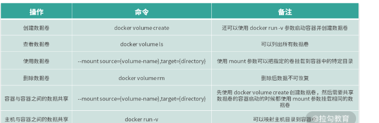

# 数据存储：剖析Docker卷与持久化数据存储的底层原理

## 为什么容器需要持久化存储

容器按照业务类型，总体分为两类：

- 无状态的（数据不需要被持久化存储）
- 有状态的（所以需要持久化存储）

显然，容器更擅长无状态应用，因为为持久化数的容器根目录的生命周期与容器的生命周期一样，容器文件系统的本质是在镜像层上面创建的读写层，运行中的容器对任何文件的修改都存在于该读写层，当容器被删除的时候，读写层也会随之消失。

虽然容器希望所有的业务尽量保持无状态，这样容器就可以开向即用，并且可以人一调度，但是在实际业务中有各种需要数据持久化的场景，比如MySQL、Kafka等有状态的业务。因此为了解决有主嗯台业务的需求，Docker提出了卷（Volumn）的概念。

什么是卷？卷的本质是文件或者目录，它可以人绕过默认的联合文件系统，直接以文件或者目录的形式存在于宿主机上。卷的概念不仅解决了数据持久化的问题，还解决容器之间共享数据的问题。使用卷可以将容器内的目录或者文件格式化，当容器后保持数据不丢失，例如我们可以使用卷将MySQL的目录持久化，实现容器重启数据库数据不丢失。

Docker提供了卷（Volume）的功能，使用`docker volumn`命令可以实现对卷的创建、查看和删除等操作。

## Docker的卷操作

### 创建数据卷

使用`docker volume cereate`命令可以创建一个数据卷。

我们使用一下命令创建一个名为myvolume的数据卷：

```bash
$ docker volume create myvolume
```

在这里要说明下，默认情况下，Docker创建的数据卷为local模式，仅能提供本机的容器访问。如果想要实现远程访问，需要借助网络存储来实现。Docker的local存储模式并为提供配额管理，因此在生产环境中需要手动维护磁盘存储空间。

除了使用`docker volume create`的方式创建卷，我们还可以在Docker启动的时候使用-v的方式指定容器内需要被持久化的路径，Docker会自动为我们创建卷，并且绑定到容器中，使用命令如下：

```bash
$ docker run -d --name=nginx-volume -v /user/share/nginx/html nginx
```

使用以上命令，我们启动一个nginx容器，-v参数时的Docker自动生成一个卷并且绑定到容器的`/usr/share/nginx/html`目录中。我们可以使用`docker volume ls`命令来查看主机上的卷：

```bash
$ docker volume ls

DRIVER              VOLUME NAME

local               eaa8a223eb61a2091bf5cd5247c1b28ac287450a086d6eee9632d9d1b9f69171
```

可以看到，Docker自动为我们创建了一个名称为随机ID的卷。

### 查看数据卷

已经创建的数据卷可以使用docker volume ls命令查看。

```bash
$ docker volume ls

DRIVER              VOLUME NAME

local               myvolume
```

通过输出可以看到myvolume的卷已经创建成功。如果想要查看某个数据卷的详细信息，可以使用`docker volume inspect`命令。例如，我想查看myvolume的详细信息，命令如下：

```bash
$ docker volume inspect myvolume

    {

        "CreatedAt": "2020-09-08T09:10:50Z",

        "Driver": "local",

        "Labels": {},

        "Mountpoint": "/var/lib/docker/volumes/myvolume/_data",

        "Name": "myvolume",

        "Options": {},

        "Scope": "local"

    }

]
```

通过`docker volume inspect`命令可以看到卷的创建日期、命令、挂载路径信息。

### 使用卷

使用`docker volume`创建的卷在容器启动的时候，添加--mount参数指定的卷名称即可使用。

这里我们使用上一步创建的卷来启动一个nginx容器，并将/usr/share/nginx/html目录与卷关联，命令如下：

```bash
$ docker run -d --name=nginx --mount source=myvolume,target=/usr/share/nginx/html nginx
```

使用Docker的卷可以实现指定的目录的文件持久化，下面我们进入容器中并且修改index.html文件内容，命令如下：

```bash
$ docker exec -it  nginx bash

## 使用以下内容直接替换 /usr/share/nginx/html/index.html 文件 

root@719d3c32e211:/# cat <<EOF >/usr/share/nginx/html/index.html

<!DOCTYPE html>

<html>

<head>

<title>Hello, Docker Volume!</title>

<style>

    body {

        width: 35em;

        margin: 0 auto;

        font-family: Tahoma, Verdana, Arial, sans-serif;

    }

</style>

</head>

<body>

<h1>Hello, Docker Volume!</h1>

</body>

</html>

EOF
```

此时我们使用`docker rm`命令将运行中的nginx容器彻底删除。

```bash
$ docker rm -f nginx
```

旧的nginx容器删除后，我们在使用`docker run`命令启动一个新的容器，并且挂载myvolume卷，命令如下。

```bash
$ docker run -d --name=nginx --mount source=myvolume,target=/usr/share/nginx/html nginx
```

新的容器启动后，我们进入容器查看一下index.html文件内容：

```bash
$ docker exec -it nginx bash

root@7ffac645f431:/# cat /usr/share/nginx/html/index.html

<!DOCTYPE html>

<html>

<head>

<title>Hello, Docker Volume!</title>

<style>

    body {

        width: 35em;

        margin: 0 auto;

        font-family: Tahoma, Verdana, Arial, sans-serif;

    }

</style>

</head>

<body>

<h1>Hello, Docker Volume!</h1>

</body>

</html>
```

可以看到，此时index.html文件内容依旧为我们之前写入的内容。可见，使用Docker卷后我们的数据并没有随着容器的删除而消失。

### 删除数据卷

容器的删除并不会自动删除已经创建的数据卷，因为不再使用数据卷需要我们手动删除，删除的命令为`docker volume rm`。

```bash
$ docker volume rm myvolume
```

这里需要注意，正在被使用的数据卷无法删除，如果你想要删除正在使用的数据卷，需要先删除所有的关联容器。

有时候，两个容器之间会有共享数据的需求，很经典的一个场景就是容器内产生日志需要另一个专门的日至采集程序区采集日至内容。

### 容器与容器之间数据共享

那如何实现容器与容器之间的数据共享呢？

首先使用`docker volume create`命令创建一个共享日志的数据库。

```bash
$ docker volume create log-vol
```

启动一个生产日志的容器（下面用producer窗口来表示）：

```bash
$ docker run --mount source=log-vol,target=/tmp/log --name=log-producer -it busybox
```

然后新打开一个命令行窗口，启动一个消费者容器（下面用consumer窗口表示）：

```bash
$ docker run -it --name consumer --volumes-from log-producer busybox
```

使用`volume-from`参数可以在启动新的容器时来挂载已经存在的容器的卷，`volume-from`参数后面跟已经启动的容器名称。下面我们切换到producer窗口，使用下面命令策划奴关键一个mylog.log文件并写入“Hello， My log.”的内容：

```bash
/ # cat <<EOF >/tmp/log/mylog.log

Hello, My log.

EOF
```

然后我们切换到consumer窗口，查看一下相关内容：

```bash
/ # cat /tmp/log/mylog.log

Hello, My log.
```

可以看到我们从producer容器写入的文件内容会自动出现在cunsumer容器中，证明我们成功实现两个容器之间的数据共享。

总结一下，我们首先使用docker volume create命令创建log-vol卷来作为共享目录，log-producer容器向该容器写入数据，consumer容器从该卷读取数据。这就像主机上的两个进程，一个向主机目录写数据，一个从主机读数据，利用主机的目录，实现容器之间的数据共享。

### 主机与容器之间共享数据

Docker卷的目录默认在`/var/lib/docker`下，当我们想把主机的其他目录映射到容器内的时候，就需要用到主机与容器之间数据共享的方式了例如我们想把MySQL容器中的`/var/lib/mysql`目录映射到主机的`/var/lib/mysql`目录中，我们就可以使用主机与容器之间数据共享的方式实现。

要实现主机与容器之间的数据共享，其实很简单，只需要我们在启动容器的时候添加-v参数即可，使用格式为：`-v HOST_PAT:CONTINAER_PATH`。

例如，我想挂载主机的`/data`目录到容器中的`/usr/local/data`中，可以使用以下命令来启动容器：

```bash
$ docker run -v /data:/user/local/data -it busybox
```

容器启动后，便可以在容器内的`/uer/local/data`访问到主机的`/data`目录的内容了，并且容器重启后，`/data`目录下的数据也不会丢失。



## Docker卷的实现原理

在了解 Docker 卷的原理之前，我们先来回顾一下镜像和容器的文件系统原理。

> **镜像和容器的文件系统原理：** 镜像是由多层文件系统组成的，当我们想要启动一个容器时，Docker 会在镜像上层创建一个可读写层，容器中的文件都工作在这个读写层中，当容器删除时，与容器相关的工作文件将全部丢失。

Docker 容器的文件系统不是一个真正的文件系统，而是通过联合文件系统实现的一个伪文件系统，而 Docker 卷则是直接利用主机的某个文件或者目录，它可以绕过联合文件系统，直接挂载主机上的文件或目录到容器中，这就是它的工作原理。

下面，我们通过一个实例来说明卷的工作原理。首先，我们创建一个名称为 volume-data 的卷：

```kotlin
$ docker volume create volume-data
```

我们使用 ls 命令查看一下 /var/lib/docker/volumes 目录下的内容：

```shell
$ sudo ls -l /var/lib/docker/volumes

drwxr-xr-x. 3 root root    19 Sep  8 10:59 volume-data
```

然后再看下 volume-data 目录下有什么内容：

```shell
$ sudo ls -l /var/lib/docker/volumes/volume-data

total 0

drwxr-xr-x. 2 root root 6 Sep  8 10:59 _data
```

可以看到我们创建的卷出现在了 /var/lib/docker/volumes 目录下，并且 volume-data 目录下还创建了一个 _data 目录。

实际上，在我们创建 Docker 卷时，Docker 会把卷的数据全部放在 /var/lib/docker/volumes 目录下，并且在每个对应的卷的目录下创建一个 _data 目录，然后把 _data 目录绑定到容器中。因此我们在容器中挂载卷的目录下操作文件，实际上是在操作主机上的 _data 目录。为了证实我的说法，我们来实际演示下。

首先，我们启动一个容器，并且绑定 volume-data 卷到容器内的 /data 目录下：

```bash
$  docker run -it --mount source=volume-data,target=/data busybox

/ #
```

我们进入到容器的 /data 目录，创建一个 data.log 文件:

```bash
/ # cd data/

/data # touch data.log
```

然后我们新打开一个命令行窗口，查看一下主机上的文件内容：

```kotlin
$  sudo ls -l /var/lib/docker/volumes/volume-data/_data

total 0

-rw-r--r--. 1 root root 0 Sep  8 11:15 data.log
```

可以看到主机上的 _data 目录下也出现了 data.log 文件。这说明，在容器内操作卷挂载的目录就是直接操作主机上的 _data 目录，符合我上面的说法。

综上，**Docker 卷的实现原理是在主机的 /var/lib/docker/volumes 目录下，根据卷的名称创建相应的目录，然后在每个卷的目录下创建 _data 目录，在容器启动时如果使用 –mount 参数，Docker 会把主机上的目录直接映射到容器的指定目录下，实现数据持久化。**

