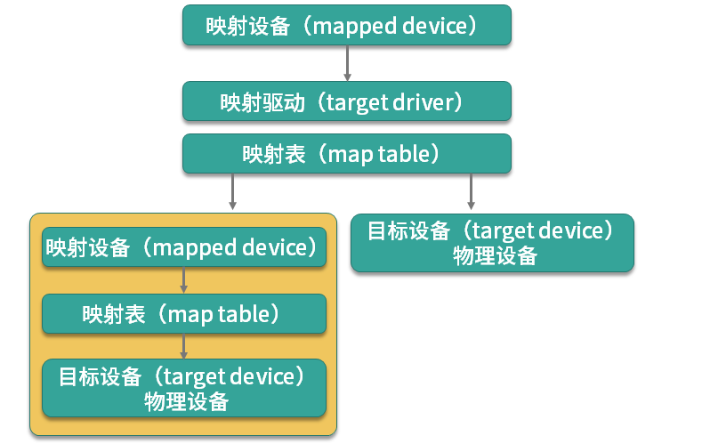
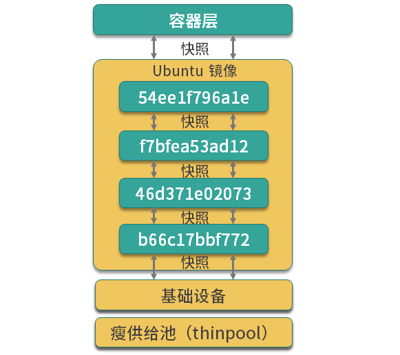

# 文件存储驱动：Devicemapper 文件系统原理及生产环境的最佳配置

上一课时我带你学习了什么是联合文件系统，以及 AUFS 的工作原理和配置。我们知道 AUFS 并不在 Linux 内核主干中，所以如果你的操作系统是 CentOS，就不推荐使用 AUFS 作为 Docker 的联合文件系统了。

那在 CentOS 系统中，我们怎么实现镜像和容器的分层结构呢？我们通常使用 Devicemapper 作为 Docker 的联合文件系统。

## 什么是 Devicemapper ？

Devicemapper 是 Linux 内核提供的框架，从 Linux 内核 2.6.9 版本开始引入，Devicemapper 与 AUFS 不同，AUFS 是一种文件系统，而**Devicemapper 是一种映射块设备的技术框架。**

Devicemapper 提供了一种将物理块设备映射到虚拟块设备的机制，目前 Linux 下比较流行的 LVM （Logical Volume Manager 是 Linux 下对磁盘分区进行管理的一种机制）和软件磁盘阵列（将多个较小的磁盘整合成为一个较大的磁盘设备用于扩大磁盘存储和提供数据可用性）都是基于 Devicemapper 机制实现的。

那么 Devicemapper 究竟是如何实现的呢？下面我们首先来了解一下它的关键技术。

## Devicemapper 的关键技术

Devicemapper 将主要的工作部分分为用户空间和内核空间。

- 用户空间负责配置具体的设备映射策略与相关的内核空间控制逻辑，例如逻辑设备 dm-a 如何与物理设备 sda 相关联，怎么建立逻辑设备和物理设备的映射关系等。
- 内核空间则负责用户空间配置的关联关系实现，例如当 IO 请求到达虚拟设备 dm-a 时，内核空间负责接管 IO 请求，然后处理和过滤这些 IO 请求并转发到具体的物理设备 sda 上。

这个架构类似于 C/S （客户端/服务区）架构的工作模式，客户端负责具体的规则定义和配置下发，服务端根据客户端配置的规则来执行具体的处理任务。

Devicemapper 的工作机制主要围绕三个核心概念。

- 映射设备（mapped device）：即对外提供的逻辑设备，它是由 Devicemapper 模拟的一个虚拟设备，并不是真正存在于宿主机上的物理设备。
- 目标设备（target device）：目标设备是映射设备对应的物理设备或者物理设备的某一个逻辑分段，是真正存在于物理机上的设备。
- 映射表（map table）：映射表记录了映射设备到目标设备的映射关系，它记录了映射设备在目标设备的起始地址、范围和目标设备的类型等变量。



Devicemapper 三个核心概念之间的关系如图 1，**映射设备通过映射表关联到具体的物理目标设备。事实上，映射设备不仅可以通过映射表关联到物理目标设备，也可以关联到虚拟目标设备，然后虚拟目标设备再通过映射表关联到物理目标设备。**

Devicemapper 在内核中通过很多模块化的映射驱动（target driver）插件实现了对真正 IO 请求的拦截、过滤和转发工作，比如 Raid、软件加密、瘦供给（Thin Provisioning）等。其中瘦供给模块是 Docker 使用 Devicemapper 技术框架中非常重要的模块，下面我们来详细了解下瘦供给（Thin Provisioning）。

### 瘦供给（Thin Provisioning）

瘦供给的意思是动态分配，这跟传统的固定分配不一样。传统的固定分配是无论我们用多少都一次性分配一个较大的空间，这样可能导致空间浪费。而瘦供给是我们需要多少磁盘空间，存储驱动就帮我们分配多少磁盘空间。

这种分配机制就好比我们一群人围着一个大锅吃饭，负责分配食物的人每次都给你一点分量，当你感觉食物不够时再去申请食物，而当你吃饱了就不需要再去申请食物了，从而避免了食物的浪费，节约的食物可以分配给更多需要的人。

那么，你知道 Docker 是如何使用瘦供给来做到像 AUFS 那样分层存储文件的吗？答案就是： Docker 使用了瘦供给的快照（snapshot）技术。

什么是快照（snapshot）技术？这是全球网络存储工业协会 SNIA（StorageNetworking Industry Association）对快照（Snapshot）的定义：

> 关于指定数据集合的一个完全可用拷贝，该拷贝包括相应数据在某个时间点（拷贝开始的时间点）的映像。快照可以是其所表示的数据的一个副本，也可以是数据的一个复制品。

简单来说，**快照是数据在某一个时间点的存储状态。快照的主要作用是对数据进行备份，当存储设备发生故障时，可以使用已经备份的快照将数据恢复到某一个时间点，而 Docker 中的数据分层存储也是基于快照实现的。**

以上便是实现 Devicemapper 的关键技术，那 Docker 究竟是如何使用 Devicemapper 实现存储数据和镜像分层共享的呢？

## Devicemapper 是如何数据存储的？

当 Docker 使用 Devicemapper 作为文件存储驱动时，**Docker 将镜像和容器的文件存储在瘦供给池（thinpool）中，并将这些内容挂载在 /var/lib/docker/devicemapper/ 目录下。**

这些目录储存 Docker 的容器和镜像相关数据，目录的数据内容和功能说明如下。

- devicemapper 目录（/var/lib/docker/devicemapper/devicemapper/）：存储镜像和容器实际内容，该目录由一个或多个块设备构成。
- metadata 目录（/var/lib/docker/devicemapper/metadata/）： 包含 Devicemapper 本身配置的元数据信息, 以 json 的形式配置，这些元数据记录了镜像层和容器层之间的关联信息。
- mnt 目录（ /var/lib/docker/devicemapper/mnt/）：是容器的联合挂载点目录，未生成容器时，该目录为空，而容器存在时，该目录下的内容跟容器中一致。

## Devicemapper 如何实现镜像分层与共享？

Devicemapper 使用专用的块设备实现镜像的存储，并且像 AUFS 一样使用了写时复制的技术来保障最大程度节省存储空间，所以 Devicemapper 的镜像分层也是依赖快照来是实现的。

Devicemapper 的每一镜像层都是其下一层的快照，最底层的镜像层是我们的瘦供给池，通过这种方式实现镜像分层有以下优点。

- 相同的镜像层，仅在磁盘上存储一次。例如，我有 10 个运行中的 busybox 容器，底层都使用了 busybox 镜像，那么 busybox 镜像只需要在磁盘上存储一次即可。
- 快照是写时复制策略的实现，也就是说，当我们需要对文件进行修改时，文件才会被复制到读写层。
- 相比对文件系统加锁的机制，Devicemapper 工作在块级别，因此可以实现同时修改和读写层中的多个块设备，比文件系统效率更高。

当我们需要读取数据时，如果数据存在底层快照中，则向底层快照查询数据并读取。当我们需要写数据时，则向瘦供给池动态申请存储空间生成读写层，然后把数据复制到读写层进行修改。Devicemapper 默认每次申请的大小是 64K 或者 64K 的倍数，因此每次新生成的读写层的大小都是 64K 或者 64K 的倍数。

以下是一个运行中的 Ubuntu 容器示意图。



这个 Ubuntu 镜像一共有四层，每一层镜像都是下一层的快照，镜像的最底层是基础设备的快照。当容器运行时，容器是基于镜像的快照。综上，Devicemapper 实现镜像分层的根本原理就是快照。

接下来，我们看下如何配置 Docker 的 Devicemapper 模式。

## 如何在 Docker 中配置 Devicemapper

Docker 的 Devicemapper 模式有两种：第一种是 loop-lvm 模式，该模式主要用来开发和测试使用；第二种是 direct-lvm 模式，该模式推荐在生产环境中使用。

下面我们逐一配置，首先来看下如何配置 loop-lvm 模式。

### 配置 loop-lvm 模式

1.使用以下命令停止已经运行的 Docker：

```ruby
$ sudo systemctl stop docker
```

2.编辑 /etc/docker/daemon.json 文件，如果该文件不存在，则创建该文件，并添加以下配置：

```json
{

  "storage-driver": "devicemapper"

}
```

3.启动 Docker：

```ruby
$ sudo systemctl start docker
```

4.验证 Docker 的文件驱动模式：

```yaml
$ docker info

Client:

 Debug Mode: false

Server:

 Containers: 1

  Running: 0

  Paused: 0

  Stopped: 1

 Images: 1

 Server Version: 19.03.12

 Storage Driver: devicemapper

  Pool Name: docker-253:1-423624832-pool

  Pool Blocksize: 65.54kB

  Base Device Size: 10.74GB

  Backing Filesystem: xfs

  Udev Sync Supported: true

  Data file: /dev/loop0

  Metadata file: /dev/loop1

  Data loop file: /var/lib/docker/devicemapper/devicemapper/data

  Metadata loop file: /var/lib/docker/devicemapper/devicemapper/metadata

  Data Space Used: 22.61MB

  Data Space Total: 107.4GB

  Data Space Available: 107.4GB

  Metadata Space Used: 17.37MB

  Metadata Space Total: 2.147GB

  Metadata Space Available: 2.13GB

  Thin Pool Minimum Free Space: 10.74GB

  Deferred Removal Enabled: true

  Deferred Deletion Enabled: true

  Deferred Deleted Device Count: 0

  Library Version: 1.02.164-RHEL7 (2019-08-27)

... 省略部分输出
```

可以看到 Storage Driver 为 devicemapper，这表示 Docker 已经被配置为 Devicemapper 模式。

但是这里输出的 Data file 为 /dev/loop0，这表示我们目前在使用的模式为 loop-lvm。但是由于 loop-lvm 性能比较差，因此不推荐在生产环境中使用 loop-lvm 模式。下面我们看下生产环境中应该如何配置 Devicemapper 的 direct-lvm 模式。

### 配置 direct-lvm 模式

1.使用以下命令停止已经运行的 Docker：

```ruby
$ sudo systemctl stop docker
```

2.编辑 /etc/docker/daemon.json 文件，如果该文件不存在，则创建该文件，并添加以下配置：

```json
{

  "storage-driver": "devicemapper",

  "storage-opts": [

    "dm.directlvm_device=/dev/xdf",

    "dm.thinp_percent=95",

    "dm.thinp_metapercent=1",

    "dm.thinp_autoextend_threshold=80",

    "dm.thinp_autoextend_percent=20",

    "dm.directlvm_device_force=false"

  ]

}
```

其中 directlvm_device 指定需要用作 Docker 存储的磁盘路径，Docker 会动态为我们创建对应的存储池。例如这里我想把 /dev/xdf 设备作为我的 Docker 存储盘，directlvm_device 则配置为 /dev/xdf。

3.启动 Docker：

```ruby
$ sudo systemctl start docker
```

4.验证 Docker 的文件驱动模式：

```yaml
$ docker info

Client:

 Debug Mode: false

Server:

 Containers: 1

  Running: 0

  Paused: 0

  Stopped: 1

 Images: 1

 Server Version: 19.03.12

 Storage Driver: devicemapper

  Pool Name: docker-thinpool

  Pool Blocksize: 65.54kB

  Base Device Size: 10.74GB

  Backing Filesystem: xfs

  Udev Sync Supported: true

  Data file:

  Metadata file:

  Data loop file: /var/lib/docker/devicemapper/devicemapper/data

  Metadata loop file: /var/lib/docker/devicemapper/devicemapper/metadata

  Data Space Used: 22.61MB

  Data Space Total: 107.4GB

  Data Space Available: 107.4GB

  Metadata Space Used: 17.37MB

  Metadata Space Total: 2.147GB

  Metadata Space Available: 2.13GB

  Thin Pool Minimum Free Space: 10.74GB

  Deferred Removal Enabled: true

  Deferred Deletion Enabled: true

  Deferred Deleted Device Count: 0

  Library Version: 1.02.164-RHEL7 (2019-08-27)

... 省略部分输出
```

当我们看到 Storage Driver 为 devicemapper，并且 Pool Name 为 docker-thinpool 时，这表示 Devicemapper 的 direct-lvm 模式已经配置成功。