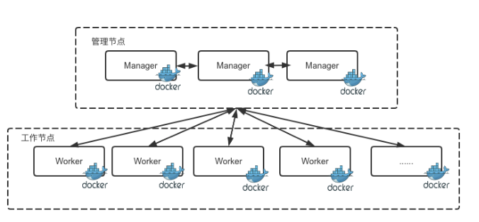
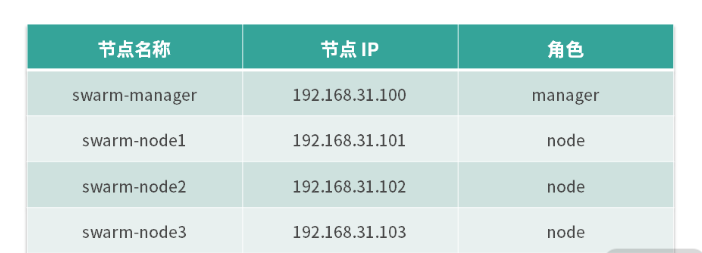

# 如何在生产环境中使用Docker Swarm调度容器？

上一节我们介绍了Docker的单节点引擎工具Docker Compose，它能够在单一节点上管理和编排多个容器，当我们的服务和容器数量较小的时候可以使用Docker Compose来管理容器。

然而随着我们的业务规模越来越大，我们的容器规模也随之增大时，数量庞大的容器管理将给我们带来许多的挑战。Docker官方为了解决管理的问题推出了Docker Swarm，我们可以用它来管理规模更大的容器集群。

## Swarm的前世今生

2014年Docker在容器界越来越火，这时容器的编排工具Mesos和Kubernetes也开始湛露头角。此时，Docker公司也开始筹划容器的编排和集群管理工具，推出了自己的通信协议项目Beam。后来，通过改进Beam，Beam成为一个允许使用Docker API来控制的分布式系统，之后项目被重命名为libswarm。然而在2014年11月，Docker公司又对libswarm进行了重新设计，支持了远程调用API，并且被重新命名为Swarm。到此我们称之为Swarm V1。

在2016年，为了解决中央服务可拓展性的问题，Docker团队重新设计了Swarm，并称之为Swarm V2。此时的Docker Swarm以及尼古可以支持超过1000多个节点的集群规模，并且Docker团队在发布Docker1.12版本时，将Docker Swarm默认集成到了Docker引擎中。

由于Swarm是Docker官方推出的的容器集群管理工具，因此Swarm最大的有时之一就是原生支持Docker API，给用户带来的极大的便利，原来的Docker用户可以很方便的服务迁移到Swarm中来。

于此同时，Swarm还内置了对Docker网络插件的支持，因此用户可以方便的部署需要跨主机通信的容器集群。其实Swarm的优点远远不止这些，还有很多，例如以下优点。

- 分布式：Swarm使用Raft（一种分布式一致性协议）协议来做集群间数据一致性保障，使用多个容器节点组成管理集群，从而避免单点故障。
- 安全：Swarm使用TLS双向认证来确保节点之间的通信安装，它可以利用双向TLS进行节点之间的简单身份认证，角色授权和加密传输，并且可以自动执行证书的办法和更换。
- 简单：Swarm的操作，并且除Docker外基本无其他外部依赖，而且从Docker1.12版本后，Swarm直接被内置到了Docker中，可以说真正做到了开箱即用。

## Swarm的架构

Swarm的架构整体分为管理节点（Manager Nodes）和工作节点（Worker Nodes），整体架构如下：



管理节点：管理节点负责接受用户的请求，用户的请求中包含用户定义的容器运行时描述，然后Swarm负责调度和管理容器，并且努力达到用户所期望的状态。

工作节点：工作节点运行执行器（Executor）负责执行具体的容器管理人物（Task），例如容器的启动、停止、删除等操作。

> 管理节点和工作节点的角色并不是一成不变的，你可以手动将工作节点转换为管理节点，也可以将管理节点转换为工作节点。

## Swarm核心概念

在真正使用Swarm之前，我们需要了解几个核心概念，这些核心概念可以帮助我们更好的学习和理解Swarm的设计理念。

### Swarm集群

Swarm集群是一组被Swarm统一管理和调度的节点，被Swarm纳管的节点可以物理及或者虚拟机。其中一部分节点作为管理节点，负责集群状态的管理和协调，另一部分作为工作节点，负责执行具体的任务来管理容器，实现用户服务的启停等功能。

### 节点

Swarm集群中的每一台物理机户在哦和虚拟机被称为节点。节点按照工作职责分为，管理节点和工作节点，管理节点由于需要使用Raft协议来协商节点状态，生产环境中通常建议将管理节点的数量设置为奇数个，一般为3个、5个、7个。

### 服务

服务是为了支持容器编排所提出的概念，它是一系列复杂容器环境互相协作的统称。一个服务的生命通常包含容器的启动法那个是、启动的副本数、环境变量、存储、配置、网络等一系列的配置，用户通过声明一个服务，将它交给Swarm，Swarm负责将用户声明的服务实现。

服务分为全局服务（global services）和副本服务（replicated services）。

- 全局服务：每个工作节点上都会运行一个人物，类似于Kubernetes中的Daemonset。
- 副本服务：按照指定的副本数在整个集群中调度运行。

### 任务

任务是集群中的最小调度单位，它包含了一个真正运行的Docker容器。当管理节点根据服务中声明的副本数据将任务调度到节点，任务则开始在该节点启动和运行，当节点出现异常的时候，任务会运行失败。此时调度期会把失败的任务重新调度到其他正常的节点上正常运行，以确保运行中的容器副本数满足用户所期望的副本数。

### 服务外部访问

由于容器的IP只能在集群内部访问到，而且容器又是用后马上销毁，这样的容器的IP也会动态变化，因此容器集群内部的服务想要被集群外部的用户访问到，服务必须要映射到主机上的固定端口。Swarm使用入口负载均衡（ingress load balancing）模式将服务暴露在主机上，该模式下，每一个服务会被分配一个公开端口（PublishedPort），你可以指定使用某个为被占用的公开端口，也可以让Swarm自动分配一个。

Swarm集群的公开端口可以从集群内的任意节点上访问到，当请求达到集群的一个节点时，如果该节点没有要请求的服务，则会将请求转发到实际运行该服务的节点，从而响应用户的请求。公有云的云负载均衡器（cloud load balancers）可以利用这一特性将流量导入到集群中的一个或多个节点，从而实现利用共有云的云负载均衡器将流量导入到集群中的服务。

## 搭建Swarm集群

要想使用Swarm集群有如下一些要求：

- Docker版本大于1.12
- 主机需要开放一些端口（TCP：2377、UDP：4789、TCP和UDP：7946）。

下面我通过四台计算机来搭建一个Swarm集群，演示的节点规划如下：



> 生产环境中推荐使用至少三个manager作为管理节点。

- 第一步：初始化集群

Docker 1.12 版本后， Swarm 已经默认集成到了 Docker 中，因此我们可以直接使用 Docker 命令来初始化 Swarm，集群初始化的命令格式如下：

```csharp
docker swarm init --advertise-addr <YOUR-IP>
```

> advertise-addr 一般用于主机有多块网卡的情况，如果你的主机只有一块网卡，可以忽略此参数。

在管理节点上，通过以下命令初始化集群：

```csharp
$ docker swarm init

Swarm initialized: current node (1ehtnlcf3emncktgjzpoux5ga) is now a manager.

To add a worker to this swarm, run the following command:

    docker swarm join --token SWMTKN-1-1kal5b1iozbfmnnhx3kjfd3y6yqcjjjpcftrlg69pm2g8hw5vx-8j4l0t2is9ok9jwwc3tovtxbp 192.168.31.100:2377

To add a manager to this swarm, run 'docker swarm join-token manager' and follow the instructions.
```

集群初始化后， Swarm 会提示我们当前节点已经作为一个管理节点了，并且提示了如何把一台主机加入集群成为工作节点。

- 第二步：加入工作节点

按照第一步集群初始化后输出的提示，只需要复制其中的命令即可，然后在剩余的三台工作节点上分别执行如下命令：

```csharp
$ docker swarm join --token SWMTKN-1-1kal5b1iozbfmnnhx3kjfd3y6yqcjjjpcftrlg69pm2g8hw5vx-8j4l0t2is9ok9jwwc3tovtxbp 192.168.31.100:2377

This node joined a swarm as a worker.
```

默认加入的节点为工作节点，如果是生产环境，我们可以使用`docker swarm join-token manager`命令来查看如何加入管理节点：

```csharp
$ docker swarm join-to ken manager

To add a manager to this swarm, run the following command:

    docker swarm join --token SWMTKN-1-1kal5b1iozbfmnnhx3kjfd3y6yqcjjjpcftrlg69pm2g8hw5vx-8fq89jxo2axwggryvom5a337t 192.168.31.100:2377
```

复制 Swarm 输出的结果即可加入管理节点到集群中。

> 注意：管理节点的数量必须为奇数，生产环境推荐使用3个、5个或7个管理节点来管理 Swarm 集群。

- 第三步：节点查看

节点添加完成后，我们使用以下命令可以查看当前节点的状态：

```markdown
$ ]# docker node ls

ID                            HOSTNAME            STATUS              AVAILABILITY        MANAGER STATUS      ENGINE VERSION

1ehtnlcf3emncktgjzpoux5ga *   swarm-manager       Ready               Active              Leader              19.03.12

pn7gdm847sfzydqhcv3vma97y *   swarm-node1         Ready               Active                                        19.03.12

4dtc9pw5quyjs5yf25ccgr8uh *   swarm-node2         Ready               Active                                        19.03.12

est7ww3gngna4u7td22g9m2k5 *   swarm-node3         Ready               Active                                        19.03.12
```

到此，一个包含 1 个管理节点，3 个工作节点的 Swarm 集群已经搭建完成。

### 使用 Swarm

集群搭建完成后，我们就可以在 Swarm 集群中创建服务了，Swarm 集群中常用的服务部署方式有以下两种。

#### （1）通过 docker service 命令创建服务

使用`docker service create`命令可以创建服务，创建服务的命令如下：

```sql
$ docker service create --replicas 1 --name hello-world nginx

24f9ng83m9sq4ml3e92k4g5by

overall progress: 1 out of 1 tasks

1/1: running   [==================================================>]

verify: Service converged
```

此时我们已经创建好了一个服务，使用`docker service ls`命令可以查看已经启动的服务：

```shell
$ docker service ls

ID                  NAME                  MODE                REPLICAS            IMAGE               PORTS

24f9ng83m9sq        hello-world           replicated          1/1                 nginx:latest
```

当我们不再需要这个服务了，可以使用`docker service rm`命令来删除服务：

```shell
$ docker service rm hello-world

hello-world
```

此时 hello-world 这个服务已经成功地从集群中删除。 想要了解更多的`docker service`命令的相关操作，可以参考[这里](https://docs.docker.com/engine/swarm/swarm-tutorial/deploy-service/)。

生产环境中，我们推荐使用 docker-compose 模板文件来部署服务，这样服务的管理会更加方便并且可追踪，而且可以同时创建和管理多个服务，更加适合生产环境中依赖关系较复杂的部署模式。

#### （2）通过 docker stack 命令创建服务

我们在 19 课时中创建了 docker-compose 的模板文件，成功的使用该模板文件创建并启动了 MySQL 服务和 WordPress 两个服务。这里我们将 19 讲中的 docker-compose 模板文件略微改造一下：

```yaml
version: '3'

services:

   mysql:

     image: mysql:5.7

     volumes:

       - mysql_data:/var/lib/mysql

     restart: always

     environment:

       MYSQL_ROOT_PASSWORD: root

       MYSQL_DATABASE: mywordpress

       MYSQL_USER: mywordpress

       MYSQL_PASSWORD: mywordpress

   wordpress:

     depends_on:

       - mysql

     image: wordpress:php7.4

     deploy:

       mode: replicated

       replicas: 2

     ports:

       - "8080:80"

     restart: always

     environment:

       WORDPRESS_DB_HOST: mysql:3306

       WORDPRESS_DB_USER: mywordpress

       WORDPRESS_DB_PASSWORD: mywordpress

       WORDPRESS_DB_NAME: mywordpress

volumes:

    mysql_data: {}
```

我在服务模板文件中添加了 deploy 指令，并且指定使用副本服务（replicated）的方式启动两个 WordPress 实例。

准备好启动 WordPress 服务的配置后，我们在 /tmp 目下新建 docker-compose.yml 文件，并且写入以上的内容，然后我们使用以下命令启动服务：

```cpp
$ docker stack deploy -c docker-compose.yml wordpress

Ignoring unsupported options: restart

Creating network wordpress_default

Creating service wordpress_mysql

Creating service wordpress_wordpress
```

执行完以上命令后，我们成功启动了两个服务：

1. MySQL 服务，默认启动了一个副本。
2. WordPress 服务，根据我们 docker-compose 模板的定义启动了两个副本。

下面我们用`docker service ls`命令查看一下当前启动的服务。

```bash
$ docker service ls

ID                  NAME                  MODE                REPLICAS            IMAGE               PORTS

v8i0pzb4e3tc        wordpress_mysql       replicated          1/1                 mysql:5.7

96m8xfyeqzr5        wordpress_wordpress   replicated          2/2                 wordpress:php7.4    *:8080->80/tcp
```

可以看到，Swarm 已经为我们成功启动了一个 MySQL 服务，并且启动了两个 WordPress 实例。WordPress 实例通过 8080 端口暴露在了主机上，我们通过访问集群中的任意节点的 IP 加 8080 端口即可访问到 WordPress 服务。例如，我们访问[http://192.168.31.101:8080](http://192.168.31.101:8080/)即可成功访问到我们搭建的 WordPress 服务。