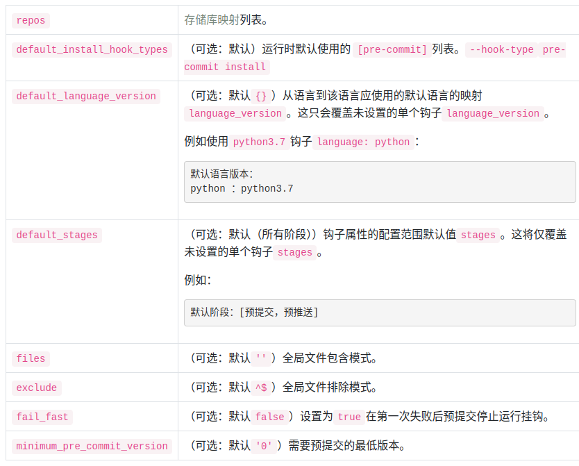

# Pre-commit

pre-commit 预提交，是 git hooks 中的一个钩子

## 安装

```bash
$ pipx install pre-commit
```

## 配置

使用`.pre-commit-config.yaml`文件进行配置

```yaml
repos:
  - repo: https://github.com/pre-commit/pre-commit-hooks
    rev: v2.3.0
    hooks:
      - id: check-yaml
      - id: end-of-file-fixer
      - id: trailing-whitespace
  - repo: https://github.com/psf/black
    rev: 22.10.0
    hooks:
      - id: black
```

## 安装 git hook 脚本

运行下面这段代码设置 git hook 脚本

```bash
$ pre-commit install
```

## 添加 pre-commit 插件

通过配置文件将预提交插件添加到项目中`.pre-commit-config.yaml`

### 顶层配置



### repos


#### hooks


### 预提交钩子参考库

https://github.com/pre-commit/pre-commit-hooks

