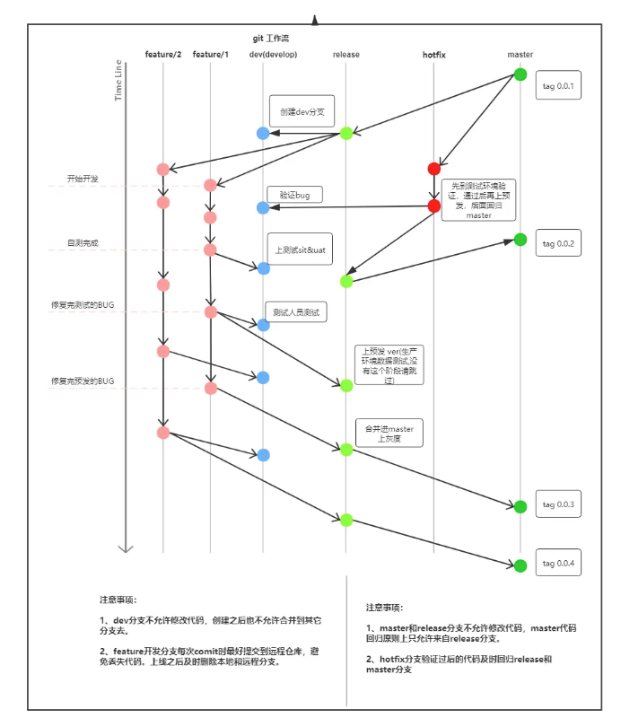

# Git团队协作规范

## 为什么要使用Git

为什么要用git?我觉得不要我多说多了吧，因为大家都在用呀，用起来就是爽！！！ 所以下面介绍点学习git资料，让你爱上学习。 话说被大伙称为[git圣经](https://link.juejin.cn?target=https%3A%2F%2Fgit-scm.com%2Fbook%2Fzh%2Fv2)， 让[猴子教你](https://link.juejin.cn?target=https%3A%2F%2Fbacklog.com%2Fgit-tutorial%2Fcn%2Fstepup%2Fstepup2_6.html)来学习下吧，同时来通过[Learn Git Branching](https://link.juejin.cn?target=https%3A%2F%2Flearngitbranching.js.org%2F%3FNODEMO)来玩下通关的刺激吧。git的相关资料大家自己再找时间去学习，接下来大家主要看下面关于我们git作业的一些相关规定，请仔细阅读，牢记在心，避免工作中踩坑。

## 分支约定

### 主分支

- master 分支原则

> - master分支存放的是随时可供在生产环境中部署的稳定版本代码
> - 一个项目只能有一个master分支
> - 仅在发布新的可供部署的代码时才更新master分支上的代码
> - 每次更新master，都需对master添加指定格式的tag(git tag -a v0.0.1 -m "填写描述")，用于发布或回滚。
> - master分支代码只能被release/*分支或hotfix或开发分支feature/*分支合并，**意味着不能在master分支上直接修改代码**

- release分支

> - 只能衍生于master分支 命名规则：release/*，“*”以本次发布的版本号为标识,比如我们的月度版本release/2020.2.27,但一般项目稳定情况下，用release作为分支名即可。
> - release主要是为发布**正式**新版本做准备，代码的合并(merge)都来源于我们**已经验证好并确定要上正式**的开发分支feature/*。
> - 一旦成功上线，**就要回归到master分支(负责发版的小伙伴来做这个动作)**，如果在release版本期间有修复改动（比如说上线前的小缺陷），也要回归到dev分支

- dev

> - dev分支是保存了**测试**环境最新的开发成果的分支
> - 一个项目只能有一个dev分支
> - dev分支主要是针对的测试版本的发布，项目**初次**开发，还是允许在此分支开发，一旦有线上版本，**后面的开发都必须从master或者release分支切一个分支出去开发（feature/\*）**。
> - dev 作为为测试环境验证分支，主要是为了满足多人同时开发多个需求时的场景。从master分支切换过来，但是**不会回归master**分支，也不能在此分支上修改代码，**此分支只用于测试环境的发版**。

### 开发分支（feature分支）

- 这个分支是针对新功能（新需求或版本迭代）的开发从master分支分叉出来的
- 命名规则feature/* 例如：feature/install 安装需求
- 此分支一般不需要提交到远程，但如果此项目本地分支比较多，还是建议提交远程，因为有丢失.git 文件风险（我就遇到过）
- 每个feature/*分支颗粒度要尽量下，比如一次只针对一个需求或者一个功能，但是如果自己比较明确两个需求能够同时验证和上线，那么颗粒度也能适当放宽。
- 开发完成后，如果此项目只有目前一个需求等待验证，那么直接用此分支发布测试验证即可，**如果有多个需求，而且是不同人在开发，请合并到dev分支发布验证。当需求验证通过后，再将此分支合并到release或者master(单独一个人开发开发，没有release分支的情况下)分支。**
- feature分支只与release分支交互，不能与dev和master分支直接交互
- 当功能因为各种原因不能开发；或者废弃了；或者已经完整上线，就直接删除这个分支，如果提交到了远程，也一并删除

### hotfix分支

- 命名规则：hotfix/* 如果是短小快速的分支，也可以用hotfix作为名称即可
- hotfix分支用来快速给已发布产品修复bug或微调功能
- 从master分支或者release/*分支衍生出来
- 修复好后，先合并到dev分支验证。验证通过后需要回归master
- hotfix分支一旦建立就将独立，不可再从其他分支pull代码

### bugfix分支

- 命名规则： bugfix/* 如果是短小快速的分支，也可以用bugfix作为名称即可
- bugfix分支用来快速给未上线产品或者迭代需求修复bug或微调功能
- 从master分支或者release分支或者对应的开发分支feature/*衍生出来
- 修复好后，先合并到 dev 分支验证。验证通过后需要回归release 和master

### 下图为分支管理的模型图

## 开发场景

> 实际开发中，我们所遇到的开发情况要比较多，有可能项目只有一个人开发，或者多人开发，或者存在一个项目同时要开发多个需求，这些需求之间又是项目独立的，其实分支管理跟实际的开发人数没有直接关系，跟开发的需求节点有直接关系，多人开发一个需求与一个人开发一个需求的分支管理是一样的，只是我们需要遵循下代码的提交规范，然后一个人开发多个需求与多个人开发多个需求其实也是一样的开发场景，下面我们来对这些场景逐一分析下。

### 开发新项目或者此时项目只有一个需求

**一个人开发**

- 我们很多小项目都是一个人开发，分支管理根据个人原因可能就会存在很多情况，但是基本的规范还是要遵循到位，以免给后人留坑。
- 如果开发新项目，此时你在master或者dev分支开发都没有关系，项目上线后，需要将最新代码全部pull到远程仓库master分支
- 如果是迭代需求，那么从master切一个feature/*（*关于分命名请查看上面关于feature分支的约定*）出来开发，禁止在master分支开发，开发完上线后，请及时回归master分支

**多人开发**

- 多人开发一个需求时，这时候一般都是在同一个分支上开发，如果遇到冲突，相互沟通看看用谁的代码
- 同样的，如果是开发新项目，此时你们在master或者dev分支开发都没有关系，项目上线后，需要将最新代码全部push到远程仓库master分支
- 同样的如果是迭代需求，那么从master切一个feature/*（*关于分命名请查看上面关于feature分支的约定*）出来开发，然后大家沟通统一好，，禁止在master分支开发，开发完上线后，请及时回归master分支

**tips**

- 大家开发迭代需求时，应该都比较喜欢直接在dev开发，当你开发完并且在测试的时候，突然产品又新增了一个需求，而且这个需求要比前面那个需求提前上线，这个时候你就只能再切两个分支出来，一个是开发突然新增需求的分支，一个是需要测试环境发版的分支。所以为了避免这样的情况发生，建议大家按照上面分支的约定，我们所有的开发需求分支都命名为feature/*

### 一个项目同时存在多个需求同时开发

**一个人开发很多个需求**

- 一个人同时在一个项目上开发多个需求，一般对于承接多个业务系统的项目遇见的比较多，笔者有幸遇见这样的项目，一个人同时开发6、7个小需求，我需要在本地同时为每个需求创建一个feature/*分支
- 由于这些分支有的在开发中，有的已经需要测试，所以需要一个测试分支（dev）来合并所有开发分支，用这个测试分支（dev）来进行测试环境的发布
- 尤其记得每个需求的代码改动只能在对应的那个开发分支（feature/*）上改动，绝对不允许在测试分支（dev）上改动

**多人开发不同的需求**

- 多人在一个项目中开发不同的需求，其实跟一个人开发多个需求的操作是一样的，只是每个人管理的分支就没有那么多，代码写错分支的情况就不容易发生
- 多人开发，难免存在冲突，尤其记得如果不确定是自己修改的，合并代码时发生了冲突，一定要和团队沟通，解决好冲突
- 同样的每个人的开发分支的代码需要合并到测试分支（dev）,同时习惯性的提交到远程，避免其他人打包时没有拉取到代码

**tips**

- 本地的分支代码最好都提交到远程，避免发生丢失代码的风险。同时当开发分支完成使命后也要记得及时删除本地和远程开发分支。